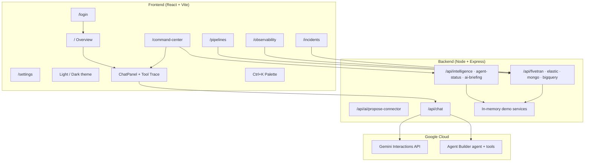

# AROA — Autonomous Reliability & Operations Agent

Enterprise-style hackathon demo for the **Google Cloud Rapid Agent Hackathon**. A full-stack data reliability control plane with auth, multi-page dashboard, Fivetran-style pipeline management, and an SRE agent powered by **Gemini Agent Builder** via the **Interactions API**.

AROA

## Architecture



```
┌──────────────────────────────────────────────────────────────────────┐
│  React SPA (localhost:5173)                                          │
│  Vite proxies /api → localhost:3001                                  │
│  ThemeContext · AuthContext · SettingsContext · ToastContext         │
│  Sidebar (AROA logo) │ Overview │ Command Center │ Pipelines │ …    │
└────────────────────────────┬─────────────────────────────────────────┘
                             │ HTTP /api/*
┌────────────────────────────▼─────────────────────────────────────────┐
│  Express API (localhost:3001)                                        │
│  /api/fivetran  /api/elastic  /api/mongo  /api/bigquery              │
│  /api/intelligence  /api/ai  /api/chat                               │
│  /api/chat ──────────────────────────► Gemini Interactions API     │
└──────────────────────────────────────────────────────────────────────┘
```

All `/api/*` tool routes return **in-memory demo data** — no live Fivetran, Elasticsearch, MongoDB, or BigQuery required.

## Prerequisites

- Node.js 20+
- Gemini API key and Agent Builder agent ID (optional — demo mode works without them)

## Quick start

### 1. Backend

```bash
cd backend
cp .env.example .env
# Edit .env — set GEMINI_API_KEY and AGENT_ID for live agent
npm install
npm run dev
```

Runs at **[http://localhost:3001](http://localhost:3001)** · Health: `GET /health`

### 2. Frontend

```bash
cd frontend
npm install
npm run dev
```

Runs at **[http://localhost:5173](http://localhost:5173)** (Vite prints the exact URL if another port is used).

> **Tip:** If the browser shows `ERR_CONNECTION_REFUSED`, the dev server is not running. Start both terminals above and use the URL Vite prints (often `5173`, sometimes `5174`).

### 3. Sign in

Open **[http://localhost:5173/login](http://localhost:5173/login)** — any non-empty email and password works (demo auth).

## Routes


| Path              | Description                                                                                                    | Auth required |
| ----------------- | -------------------------------------------------------------------------------------------------------------- | ------------- |
| `/login`          | Sign-in with AROA logo + light/dark theme toggle                                                               | No            |
| `/`               | Overview — reliability score, KPIs, connectors, incidents, live ops, agent chat                                | Yes           |
| `/command-center` | Reliability scan, Gemini executive briefing, agent copilot, SLA alerts, blast radius                           | Yes           |
| `/pipelines`      | Fivetran control plane — editable schedules, health metrics, schema/impact tabs, MAR usage, AI connector setup | Yes           |
| `/observability`  | Log search, error rate KPIs, hourly error bars — filter by 6h/24h/48h/7d or custom date range                  | Yes           |
| `/incidents`      | SEV-tagged incidents, playbooks, agent remediation                                                             | Yes           |
| `/settings`       | Demo credentials + live environment stats                                                                      | Yes           |


**Global UI:** Light/dark theme toggle in the top bar (and on login). `Ctrl+K` command palette on authenticated pages.

---

## Standout features

### Platform reliability & Command Center


| Feature                          | What it does                                                                                                        | Where to demo                                  |
| -------------------------------- | ------------------------------------------------------------------------------------------------------------------- | ---------------------------------------------- |
| **Platform Reliability Score**   | Weighted composite 0–100 across pipelines, freshness, incidents, error rate                                         | Overview + Command Center                      |
| **Full Reliability Scan**        | Orchestrates all agent tools with visible tool trace                                                                | Command Center → **Run Full Reliability Scan** |
| **Gemini Executive Briefing**    | Score hero + color-coded section cards (situation, blast radius, incidents, cost, actions) with grounding citations | Command Center → briefing panel                |
| **Agent Status Bar**             | Agent Builder connection, model, API revision, grounding source count                                               | Command Center (top)                           |
| **Agent Copilot**                | In-page chat with session ID, live/demo badge, tool trace                                                           | Command Center sidebar                         |
| **Agent Capabilities**           | Lists Interactions API features + 5 grounding sources                                                               | Command Center                                 |
| **Predictive SLA Breach Alerts** | Forecasts which BigQuery tables will breach SLA                                                                     | Command Center                                 |
| **Blast Radius Map**             | Responsive full-width lineage graph: connector → tables → views → dashboards                                        | Command Center (bottom)                        |
| **Live Ops Feed**                | Simulated real-time pipeline events (polls every 5s)                                                                | Overview + Command Center                      |
| **Command Palette**              | `Ctrl+K` shortcuts for scan, navigate, remediate                                                                    | Any authenticated page                         |


### Fivetran control plane (Pipelines 2.0)


| Feature                         | What it does                                                       | Where to demo                                                        |
| ------------------------------- | ------------------------------------------------------------------ | -------------------------------------------------------------------- |
| **Editable Connector Settings** | Update display name and sync schedule (presets or custom)          | Pipelines → **View details** → **Overview** → **Connector settings** |
| **Connector Health Dashboard**  | Last sync status, duration, rows processed, sync history sparkline | Pipelines → **View details** → **Overview** tab                      |
| **Schema & Impact**             | Schema change timeline + downstream views/dashboards               | Pipelines → **Schema & Impact** tab                                  |
| **Usage & MAR**                 | Monthly Active Rows, % change, estimated credits per connector     | Pipelines → **Usage & MAR** table                                    |
| **AI Connector Setup**          | Gemini generates pipeline config from natural language             | Pipelines → **Add connector with AI**                                |
| **Autonomous Remediation**      | One-click multi-step fix (schema → sync → freshness)               | Pipelines → failed GA4 → **Auto-fix**                                |


### Agent & transparency


| Feature                | What it does                                                      | Where to demo                                    |
| ---------------------- | ----------------------------------------------------------------- | ------------------------------------------------ |
| **Agent Tool Trace**   | Shows which tools the SRE agent invoked                           | Chat panel, scan results, Command Center copilot |
| **Session continuity** | `previous_interaction_id` for multi-turn agent memory             | Chat — session ID shown after first reply        |
| **Grounded responses** | Agent can reason over health history, schema changes, impact, MAR | Ask: *"Which connector has highest MAR?"*        |


### Observability


| Feature                  | What it does                                                 | Where to demo                                      |
| ------------------------ | ------------------------------------------------------------ | -------------------------------------------------- |
| **Timeframe filter**     | Quick ranges (6h, 24h, **48h**, 7d) or custom start/end date | Observability → top **Timeframe** bar → **Apply**  |
| **Dynamic KPIs & chart** | Events, errors, and error bars scoped to selected window     | Observability KPI row + **Errors over time** chart |
| **Scoped log stream**    | Log table filtered to the active timeframe                   | Observability → **Log stream**                     |


---

## Demo walkthroughs

### Command Center 

1. Open **Command Center** — note **Agent Status Bar** (Live vs Demo).
2. Review **Gemini Executive Briefing** — score hero on the left, section cards on the right; click a **suggested prompt** to seed the copilot.
3. Use **Agent Copilot** — ask about blast radius or remediation.
4. Click **Run Full Reliability Scan** — expand findings + tool trace.
5. Scroll to **SLA Breach Alerts** and the full-width **Blast Radius Map**.

### Pipelines / Fivetran

1. **Pipelines** — review table columns (source, destination, last sync status, finished at).
2. Open any connector → **Connector settings**: change schedule (e.g. **every 6 hours**) → **Save changes** — table updates.
3. Open **GA4** (failed) → **Overview**: health metrics + sync duration trend bars.
4. **Schema & Impact** tab — schema drift timeline + impacted BigQuery views.
5. Scroll to **Usage & MAR** — GA4 highlighted as highest MAR connector.
6. **Add connector with AI** — describe a pipeline → save → appears in table.

### Observability 

1. Open **Observability** — default shows last **24 hours**.
2. Change timeframe to **48 hours** → click **Apply** — KPIs, chart, and logs refresh.
3. Switch to **Custom date range**, pick start/end dates → **Apply**.
4. Filter logs by service chip or search (e.g. `conn_ga4_001`).

### AI-assisted connector creation

1. **Pipelines** → **Add connector with AI**
2. Describe the pipeline (e.g. *"Sync Shopify orders into BigQuery daily"*)
3. **Ask Gemini to generate config** — `/api/ai/propose-connector`
4. **Save demo connector** — `/api/fivetran/add-connector`

### Quick agent prompts

- *"Summarize blast radius for GA4 and list impacted dashboards"*
- *"Which connectors should we de-prioritize based on MAR vs downstream usage?"*
- *"Run autonomous remediation plan for conn_ga4_001"*
- *"Scan all connectors and report failures"*

---

## Demo data


| Service      | Contents                                                                                                                                                           |
| ------------ | ------------------------------------------------------------------------------------------------------------------------------------------------------------------ |
| **Fivetran** | 6 connectors: Salesforce, GA4 (failed), Postgres, Shopify, Marketo (paused), Zendesk (warning). Rich health fields, 10-run sync history, schema changes, MAR usage |
| **Elastic**  | 24+ log entries spanning up to ~60h; error rate scales with timeframe; correlated errors for GA4                                                                   |
| **Mongo**    | 4 incidents: GA4 SEV-1, Zendesk SEV-2, Marketo resolved, Shopify partial sync                                                                                      |
| **BigQuery** | Per-table freshness + `downstream_views` / dashboard impact per table                                                                                              |


---

## API reference

### Intelligence (`/api/intelligence`)


| Endpoint            | Method | Description                                           |
| ------------------- | ------ | ----------------------------------------------------- |
| `/reliability-scan` | POST   | Full platform scan + score + findings + tool trace    |
| `/sla-predictions`  | GET    | Predictive freshness breach probabilities             |
| `/lineage-graph`    | GET    | Blast radius / lineage graph data                     |
| `/auto-remediate`   | POST   | Autonomous fix sequence for a connector               |
| `/live-events`      | GET    | Live ops stream (`?since=` ISO timestamp)             |
| `/agent-status`     | GET    | Agent Builder config, capabilities, grounding sources |
| `/ai-briefing`      | POST   | Executive briefing (live Gemini when API key set)     |


### Fivetran (`/api/fivetran`)


| Endpoint                   | Method | Description                                              |
| -------------------------- | ------ | -------------------------------------------------------- |
| `/list-connectors`         | POST   | All connectors with health metrics                       |
| `/get-connector-status`    | POST   | Single connector health                                  |
| `/get-connector-logs`      | POST   | Recent logs (`connectorId`, `timeRangeHours`)            |
| `/get-connector-history`   | POST   | Last 10 sync runs (duration, status, rows)               |
| `/get-schema-changes`      | POST   | Schema drift timeline per connector                      |
| `/usage-summary`           | GET    | MAR + estimated credits per connector                    |
| `/trigger-sync`            | POST   | Trigger demo sync                                        |
| `/update-connector-schema` | POST   | Apply schema patch                                       |
| `/update-connector`        | POST   | Edit connector `name` and `schedule` (presets or custom) |
| `/pause-connector`         | POST   | Pause connector                                          |
| `/resume-connector`        | POST   | Resume connector                                         |
| `/add-connector`           | POST   | Add connector (AI flow)                                  |


### Other routes


| Route group     | Key endpoints                                                                                                          |
| --------------- | ---------------------------------------------------------------------------------------------------------------------- |
| `/api/elastic`  | `search-logs`, `get-error-rate`, `find-correlated-errors` — all accept `timeRangeHours` and/or `startTime` + `endTime` |
| `/api/mongo`    | `create-incident`, `list-incidents`, `update-incident/:id`, `get-playbook`                                             |
| `/api/bigquery` | `check-freshness`, `check-impact` (supports `primaryTable`)                                                            |
| `/api/chat`     | POST — Gemini Interactions API bridge; returns `reply`, `sessionId`, `toolTrace`, `agentMeta`                          |
| `/api/ai`       | `propose-connector` — Gemini-powered pipeline config                                                                   |


---

## Environment variables

`backend/.env`:

```env
PORT=3001
NODE_ENV=development
GEMINI_API_KEY=your_gemini_api_key
AGENT_ID=agents/YOUR_AGENT_ID
FRONTEND_ORIGIN=http://localhost:5173
```

Without valid `GEMINI_API_KEY` and `AGENT_ID`, the app runs in **demo mode** with intelligent fallbacks for chat and briefings.

---

## Frontend structure

```
frontend/
├── public/
│   └── aroa-logo.png          # Sidebar + login branding
├── src/
│   ├── contexts/              Auth, Settings, Toast, Theme
│   ├── layouts/               AppLayout (sidebar + outlet + command palette)
│   ├── pages/                 Login, Overview, CommandCenter, Pipelines, …
│   ├── components/
│   │   ├── ImpactLineageMap   # Responsive blast radius SVG
│   │   ├── ExecutiveBriefingPanel
│   │   ├── CommandCenterAgentChat
│   │   ├── AgentStatusBar, AgentGroundingPanel
│   │   ├── ConnectorUsagePanel, SyncDurationBars, ConnectorEditForm
│   │   ├── ChatPanel, AiConnectorModal, LiveOpsFeed, …
│   ├── hooks/                 useCommandPaletteActions
│   └── lib/                   api.ts (proxied /api), types, format, connectorSchedules, statusBadge
└── vite.config.ts             /api proxy → localhost:3001
```

---

## Wiring Agent Builder tools

Point your agent's tool HTTP actions at `http://localhost:3001/api/...`. Recommended tools:

- `list_connectors`, `update_connector`, `get_connector_history`, `get_schema_changes`, `usage_summary`
- `check_freshness`, `check_impact`
- `list_incidents`, `get_playbook`
- `reliability_scan`, `lineage_graph`, `auto_remediate`

The chat bridge infers tool traces from user messages and returns `agentMeta` with grounding source metadata.

---

## Troubleshooting


| Issue                             | Fix                                                                       |
| --------------------------------- | ------------------------------------------------------------------------- |
| `ERR_CONNECTION_REFUSED` on :5173 | Run `cd frontend && npm run dev`; use the URL Vite prints                 |
| Empty dashboard / API errors      | Run `cd backend && npm run dev`; check `http://localhost:3001/health`     |
| Agent always in Demo mode         | Set `GEMINI_API_KEY` and `AGENT_ID` in `backend/.env` and restart backend |
| Reliability score shows 0         | Restart backend (composite scoring); hard-refresh browser                 |
| Vercel `FUNCTION_INVOCATION_FAILED` / `ERR_REQUIRE_ESM` | Pull latest, redeploy. `api/index.js` is a bundled serverless file (run `npm run build:bundle --prefix backend` after backend edits). Set `GEMINI_API_KEY` + `AGENT_ID` in Vercel env |


---

## Deploy to Vercel

The repo is configured for a **single Vercel project**: Vite builds the React app; Express runs as a serverless function at `/api/*`.

### One-time setup

1. Push the repo to GitHub (or GitLab / Bitbucket).
2. In [Vercel](https://vercel.com), **Add New Project** → import the repository.
3. Leave **Root Directory** as the repo root (Vercel reads `vercel.json` automatically).
4. Under **Environment Variables**, add:

| Variable | Required | Notes |
| -------- | -------- | ----- |
| `GEMINI_API_KEY` | Yes (for live AI) | Google AI / Gemini API key |
| `AGENT_ID` | Yes (for live AI) | e.g. `agents/YOUR_AGENT_ID` |
| `NODE_ENV` | Optional | Set to `production` |

`VERCEL_URL` is set automatically. You do **not** need `VITE_API_URL` — the frontend calls same-origin `/api`.

5. Deploy. After deploy, open `https://<your-project>.vercel.app/health` — expect `{"ok":true}`.

### CLI (optional)

```bash
npm i -g vercel
vercel login
vercel          # preview
vercel --prod   # production
```

Set secrets with `vercel env add GEMINI_API_KEY` and `vercel env add AGENT_ID`.

### Notes

- **Demo data is in-memory** — serverless cold starts reset connector/incident state between invocations.
- **Local dev unchanged** — still run backend on `:3001` and frontend on `:5173` with the Vite proxy.
- For a **custom domain**, add it in Vercel → Domains; CORS uses `VERCEL_URL` / `FRONTEND_ORIGIN` if set.

---

## Production TODO

- Set real `GEMINI_API_KEY` and `AGENT_ID` in Vercel env (or `backend/.env` locally)
- Wire Settings UI to backend config / Secret Manager
- Swap `backend/src/services/*` demo data for real API clients
- Replace demo auth with SSO / OIDC