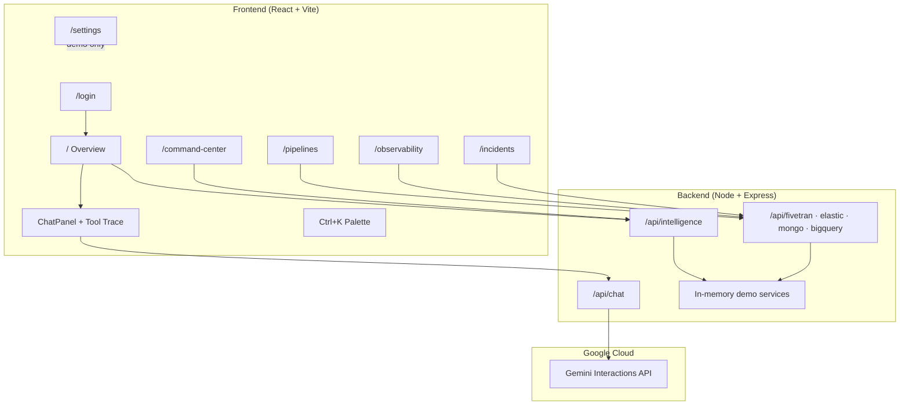

# AROA — Autonomous Reliability & Operations Agent

Enterprise-style hackathon demo for the **Google Cloud Rapid Agent Hackathon**. A full-stack reliability platform with auth, multi-page dashboard, settings UI, and an SRE agent chat bridge to **Gemini Agent Builder** via the Interactions API.

## Architecture



```
┌─────────────────────────────────────────────────────────────────┐
│  React SPA (localhost:5173)                                     │
│  ┌──────────┐  AuthContext · SettingsContext · ToastContext     │
│  │ Sidebar  │  Overview │ Command Center │ Pipelines │ …       │
│  └──────────┘  ChatPanel · Live Ops · Reliability Score         │
└────────────────────────────┬────────────────────────────────────┘
                             │ HTTP /api/*
┌────────────────────────────▼────────────────────────────────────┐
│  Express API (localhost:3001)                                   │
│  /api/fivetran  /api/elastic  /api/mongo  /api/bigquery         │
│  /api/intelligence  /api/ai (propose-connector)                 │
│  /api/chat ──────────────────────────► Gemini Interactions API  │
└─────────────────────────────────────────────────────────────────┘
```

All `/api/*` tool routes return **in-memory demo data** — no live Fivetran, Elasticsearch, MongoDB, or BigQuery required.

## Prerequisites

- Node.js 20+
- Gemini API key and Agent Builder agent ID (for live agent chat)

## Quick start

### Backend

```bash
cd backend
cp .env.example .env
# Edit .env — set GEMINI_API_KEY and AGENT_ID
npm install
npm run dev
```

Runs at **http://localhost:3001** · Health: `GET /health`

### Frontend

```bash
cd frontend
npm install
npm run dev
```

Runs at **http://localhost:5173**

## Routes

| Path | Description | Auth required |
|------|-------------|---------------|
| `/login` | Demo sign-in (any non-empty email + password) | No |
| `/` | Overview — KPIs, connectors, incidents, agent chat | Yes |
| `/pipelines` | 6+ demo connectors, AI-assisted setup, impact summaries, detail drawer | Yes |
| `/observability` | 12+ log entries, error bars, service filter chips, 5% error rate KPIs | Yes |
| `/incidents` | 4 SEV-tagged incidents, related connector info, agent remediation | Yes |
| `/settings` | Realistic fake credentials + live demo environment stats | Yes |
| `/command-center` | AI reliability score, full scan, SLA predictions, blast radius map | Yes |

## Standout features (hackathon differentiators)

| Feature | What it does | Where to demo |
|---------|--------------|---------------|
| **Platform Reliability Score** | Composite 0–100 score across connectors, freshness, errors, incidents | Overview + Command Center |
| **Full Reliability Scan** | Orchestrates all agent tools in one call with visible tool trace | Command Center → "Run Full Reliability Scan" |
| **Agent Tool Trace** | Shows which tools the SRE agent invoked (transparent AI) | Chat panel + scan results |
| **Live Ops Feed** | Simulated real-time pipeline events (polls every 5s) | Overview + Command Center |
| **Predictive SLA Breach Alerts** | Forecasts which BigQuery tables will breach SLA | Command Center table |
| **Blast Radius Map** | SVG lineage graph: connector → tables → dashboards | Command Center |
| **Autonomous Remediation** | One-click multi-step fix (schema → sync → freshness) | Pipelines → failed connector → Auto-fix |
| **Command Palette** | `Ctrl+K` power-user shortcuts for scan, navigate, remediate | Any authenticated page |
| **AI Connector Setup** | Gemini generates pipeline config from natural language | Pipelines → "Add connector with AI" |

### AI-assisted connector creation

1. Go to **Pipelines** → click **✨ Add connector with AI**
2. Describe the pipeline (e.g. *"Sync Shopify orders into BigQuery daily"*)
3. Click **Ask Gemini to generate config** — uses `/api/ai/propose-connector` (Gemini when API key set, else smart keyword fallback)
4. Review the proposal → **Save demo connector** — persists via `/api/fivetran/add-connector` and appears in Overview KPIs

### Demo data (backend)

| Service | Contents |
|---------|----------|
| **Fivetran** | 6 connectors: Salesforce, GA4 (failed), Postgres, Shopify, Marketo (paused), Zendesk (warning) |
| **Elastic** | 12 log entries across pipeline-service, api-gateway, billing-service; 5% error rate (125/2500) |
| **Mongo** | 4 incidents: GA4 SEV-1, Zendesk SEV-2, Marketo resolved, Shopify partial sync |
| **BigQuery** | Per-table freshness (GA4 CRITICAL, Shopify LATE, Salesforce OK) + dashboard impact summaries |

### Intelligence API (`/api/intelligence`)

| Endpoint | Method | Description |
|----------|--------|-------------|
| `/reliability-scan` | POST | Full platform scan + score + findings + tool trace |
| `/sla-predictions` | GET | Predictive freshness breach probabilities |
| `/lineage-graph` | GET | Downstream blast radius graph data |
| `/auto-remediate` | POST | Autonomous fix sequence for a connector |
| `/live-events` | GET | Live ops event stream (poll with `?since=`) |

## Demo video script (~3 min)

1. **Login** at `/login` — sign in with any credentials.
2. **Overview** — show Reliability Score gauge, Live Ops Feed, ask agent: *"Scan all connectors"*, expand **tool trace** under the reply.
3. **Command Center** — run **Full Reliability Scan**, walk through findings, SLA predictions, blast radius map.
4. **Pipelines** → **Add connector with AI** → describe Shopify pipeline → save → show in table.
5. **Pipelines** — open failed GA4 connector → impact summary → **Auto-fix**.
6. **Observability** — error bars, filter by `pipeline-service`, search logs.
7. **Incidents** — select GA4 SEV-1 → **Ask agent for remediation** → view playbook.
8. Press **Ctrl+K** — command palette.

## API endpoints (demo)

| Route group | Tools |
|-------------|-------|
| `/api/fivetran` | `list-connectors`, `get-connector-status`, `get-connector-logs`, `trigger-sync`, `update-connector-schema`, `pause-connector`, `resume-connector`, **`add-connector`** |
| `/api/elastic` | `search-logs`, `get-error-rate`, `find-correlated-errors` |
| `/api/mongo` | `create-incident`, `list-incidents`, `update-incident/:id`, `get-playbook` |
| `/api/bigquery` | `check-freshness`, `check-impact`, `check-impact` (with `primaryTable`) |
| `/api/chat` | Gemini Interactions API bridge |
| `/api/ai` | **`propose-connector`** — Gemini-powered pipeline config generation |

## Frontend structure (new)

```
frontend/src/
├── contexts/       AuthContext, SettingsContext, ToastContext
├── layouts/        AppLayout (sidebar + outlet)
├── pages/          Login, Overview, Pipelines, Observability, Incidents, Settings
├── components/     Sidebar, Topbar, StatCard, ChatPanel, RequireAuth, StatusBadge, …
└── lib/            api.ts, types.ts, constants.ts (DEFAULT_SETTINGS)
```

## Wiring Agent Builder tools

Point your agent's tool HTTP actions at `http://localhost:3001/api/...`. Tool names should map to the POST routes above.

## Production TODO

- [ ] Set real `GEMINI_API_KEY` and `AGENT_ID` in `backend/.env`
- [ ] Wire Settings UI values to backend config / Secret Manager (see `backend/src/config.ts`)
- [ ] Swap demo services in `backend/src/services/*` for real API clients
- [ ] Replace demo auth with real SSO / OIDC
- [ ] Update `frontend/src/lib/api.ts` base URL for deployment
